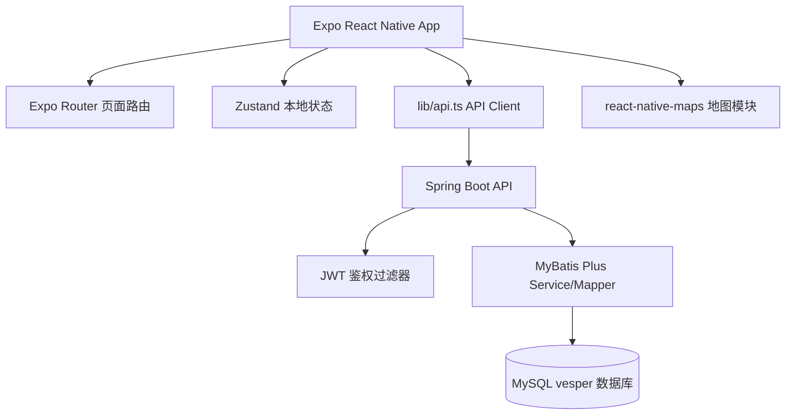
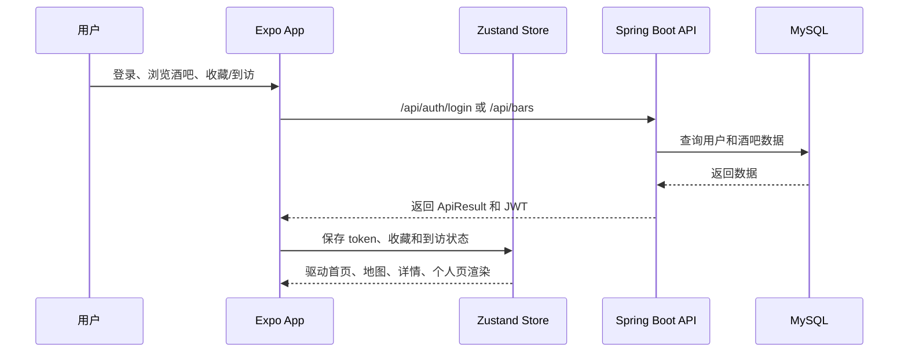

# Vesper

## 项目简介

Vesper 是一个面向夜生活场景的移动端应用原型，采用 Expo / React Native 构建前端，并配套 Spring Boot 后端提供用户认证、酒吧数据、收藏和到访记录等 API。项目重点在于移动端产品体验、跨端开发、状态管理和后端接口整合。

## 技术栈

- 移动端：Expo SDK 54、React Native、Expo Router、React Navigation、NativeWind
- 状态管理：Zustand、AsyncStorage 持久化
- 地图能力：react-native-maps，Web 端提供兼容降级组件
- 后端：Spring Boot、Spring Security、MyBatis Plus、MySQL、JWT
- API 文档：Springdoc / Swagger UI

## 系统架构



## 数据流图



## 功能说明

- 首页酒吧列表和详情页：基于本地数据与 API 数据组织酒吧信息展示。
- 用户认证：后端提供 `/api/auth/register`、`/api/auth/login`、`/api/auth/me`。
- 酒吧公开 API：后端提供 `/api/bars` 和 `/api/bars/{id}`。
- 收藏模块：后端提供 `/api/favorites/{barId}` 和 `/api/favorites`。
- 到访模块：后端提供 `/api/visited/{barId}` 和 `/api/visited`。
- 移动端本地状态：Zustand 管理登录态、收藏、到访、帖子等状态。
- 地图页面：原生端使用 `react-native-maps`，Web 端提供不依赖原生地图组件的降级实现。

## 项目结构

```text
.
├── Vesper-frontend/          # Expo / React Native 前端
│   ├── app/                  # Expo Router 页面
│   ├── components/           # 通用组件与地图组件
│   ├── lib/                  # API Client、认证会话
│   ├── stores/               # Zustand 状态管理
│   └── data/                 # 本地展示数据
├── Vesper-backend/           # Spring Boot API
│   ├── src/main/java/        # Controller、Service、Mapper、Security
│   └── src/main/resources/   # application.yml、schema.sql
├── .env.example
└── README.md
```

## 启动方式

### 1. 启动后端

准备 MySQL 数据库，并执行 `Vesper-backend/src/main/resources/db/schema.sql`。

```bash
cd Vesper-backend
mvn spring-boot:run
```

推荐环境变量：

```bash
MYSQL_URL=jdbc:mysql://localhost:3306/vesper?useUnicode=true&characterEncoding=utf8&serverTimezone=Asia/Shanghai&useSSL=false&allowPublicKeyRetrieval=true
MYSQL_USERNAME=root
MYSQL_PASSWORD=
JWT_SECRET=change-me-to-a-long-random-secret
JWT_EXPIRATION=86400000
```

### 2. 启动前端

```bash
cd Vesper-frontend
npm install
npx expo start
```

Web 调试可使用：

```bash
npm run web
```

当前仓库已经加入 Web 地图降级组件，但本机 Expo Web 仍遇到 Metro bundle 以普通脚本加载导致的 `Cannot use import.meta outside a module`，因此建议优先使用 Expo Go、iOS Simulator 或 Android Emulator 生成最终演示截图。

## API 说明

| API | 方法 | 说明 |
| --- | --- | --- |
| `/api/health` | GET | 健康检查 |
| `/api/auth/register` | POST | 注册 |
| `/api/auth/login` | POST | 登录并返回 JWT |
| `/api/auth/me` | GET | 当前用户信息 |
| `/api/bars` | GET | 酒吧列表 |
| `/api/bars/{id}` | GET | 酒吧详情 |
| `/api/favorites/{barId}` | POST | 收藏/取消收藏 |
| `/api/favorites` | GET | 收藏列表 |
| `/api/visited/{barId}` | POST | 标记到访 |
| `/api/visited` | GET | 到访列表 |

## 项目亮点

- 使用 Expo Router 组织移动端页面，覆盖首页、详情、地图、个人页、登录注册等完整移动应用流程。
- 使用 Zustand 与 AsyncStorage 管理本地登录态、收藏和到访记录，具备移动端状态持久化思路。
- 后端实现 JWT 鉴权过滤器、用户认证、酒吧查询、收藏和到访模块，接口边界清晰。
- 对 `react-native-maps` 做了 Web 降级隔离，避免原生地图模块直接阻塞 Web 构建。
- 适合作为软件工程 + 移动端全栈项目展示，但正式公开前仍需补真机/模拟器截图和演示视频。

## 截图

当前本机 Web 端未能生成有效截图。请使用 Expo Go、iOS Simulator 或 Android Emulator 补充以下截图：

- 首页酒吧推荐列表
- 酒吧详情页
- 地图页面
- 登录/注册页
- 个人页收藏/到访状态

## 运行验证记录

前端依赖已安装，Expo Web 可启动但浏览器端出现 `Cannot use import.meta outside a module`，截图为空白页。后端需要 MySQL、schema 和 JWT_SECRET 后再完整运行。
